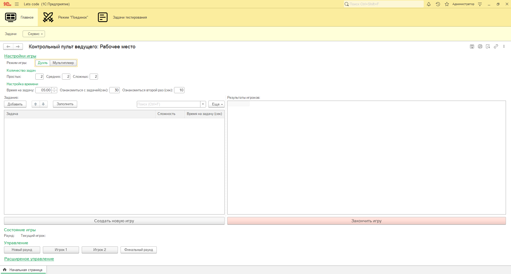
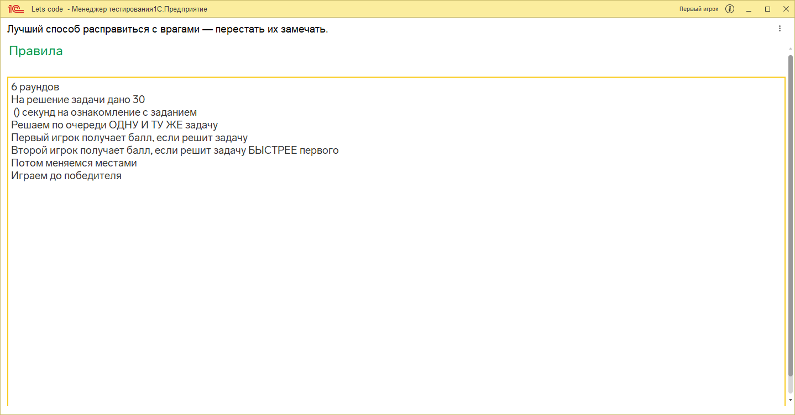
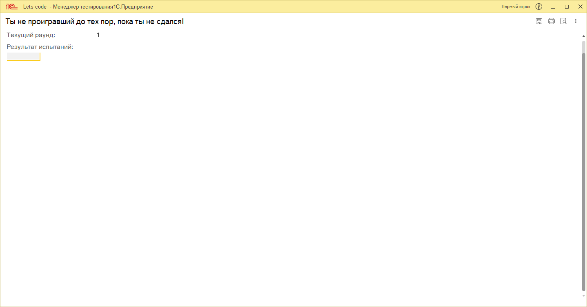
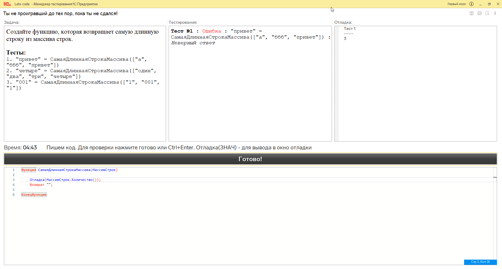
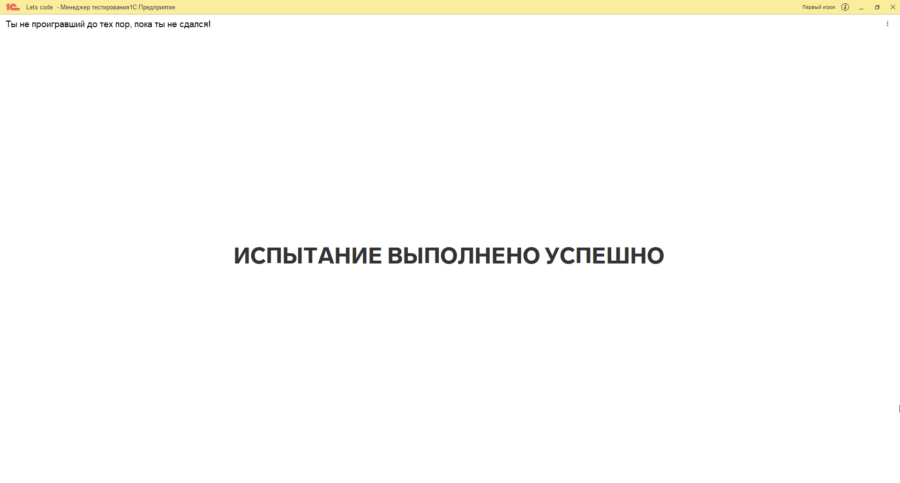

# Let's code - платформа для решения и проверки задач на встроенном языке 1С: Предприятие

Чуть меньше чем полностью переписанная конфигурация для проведения DevBattle. Оригинальная [конфигурация](https://github.com/plastinin/let-s-code)

Написана для проведения соревнования между удаленными сотрудниками. 

## Состав

### Админка для создания игр

Тип игры: дуэль или мультиплеер

Количество задач по уровням сложности

А дальше просто следуете подсказкам (кнопка будет выделена цветом)

В чрезвычайных ситуациях в расширенном управлении можно зачесть/провалить раунд конкретному игроку

### Место игрока

Игрок запускается в режиме *Рабочее место* и поэтому мало что может сделать.

Первоначально он ожидает запуска и может ознакомиться с правилами турнира.

Потом он ожидает начала испытания. Здесь видит СВОЙ текущий прогресс.

А это окно решения задачи. **Готово** отправляет код на проверку. Для вывода отладки используется команда Отладка(...). Таким образом отладочные сообщения не влияют на проверку решения.

Ну и по итогу испытание выполнено/провалено

### Режимы игры

#### Дуэль

Это режим для игры на двоих. Идея взята из youtube шоу [Неигры](https://www.youtube.com/watch?v=7FLCnmApt7U&list=PLSW6onoSLf9puwx7orVvMVrN2UQe2SMH5&index=1)

Игроки поочереди решают одну и ту же задачу, шаря экран. Первый должен уложится в лимит, второй игрок должен сделать быстрее. Потом меняемся местами.

Если к финальному раунду не выявили победителя - решаем одну и ту же задачу одновременно.

#### Мультиплеер

Режим для нескольких игроков. Это классический режим на скорость. Кто первый решил - тот и молодец.

## Задачи

Многие задачи были изменены, добавлены скрытые тесты. А так же просто добавлено много новых задач. Загрузить их можно через универсальную загрузку из файла [data.xml](./src/tasks/data.xml)

## Спасибо

Спасибо за помощь моим коллегам: [Платонов Егор](https://github.com/tseziy) и Уфимцева Алевтина
